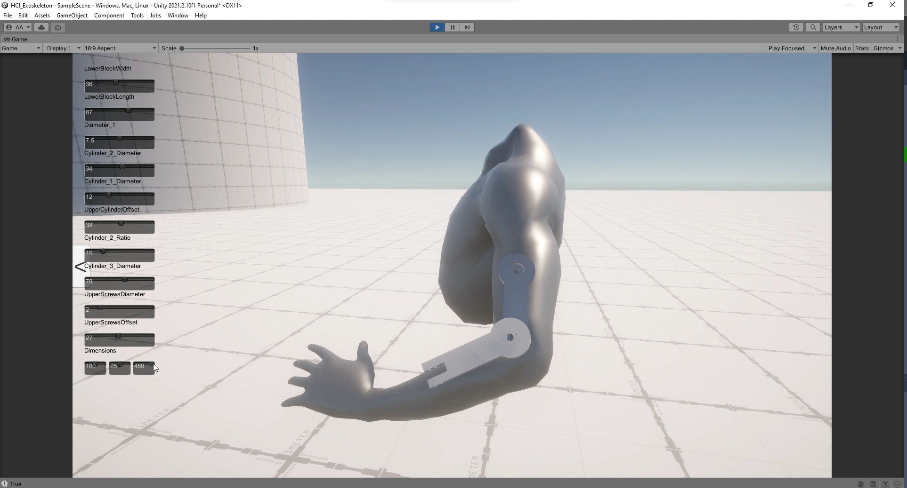

# ParExo: Parametric Design Tool for Upper-body Exoskeletons

## Overview
As part of the Wearable Robotics Seminar offered by the Human-Computer Interaction Lab at Universität des Saarlandes, our team designed a parametric design tool for upper body exoskeletons.Firstly we designed an exoskeleton with multiple degrees of freedom, three active and one passive.Secondly, we have developed a design tool for exoskeletons with the aid of Rhinoceros, Grasshopper, and Unity Framework. Our tool that leverages pretrained Machine Learning frameworks such as MediaPipe Studio developed by Google as well as our own untrained models. Both were used for the parametrization of our exoskeleton with regards to estimating the dimensions of the various segments. It also allows the customization of pre-existing exoskeletons to best match with body dimensions of the end user based on the user's biometric input data e.g. height, weight, waistline, etc.  
 
The goal of the project was to develop a software application that allows for the selection, configuration, customization, and fabrication of parts for an exoskeleton that enable students, hobbyists, and HCI researchers  delve into robotics but do not possess all of the expertise in the various fields.  

## Bill of Materials

1. Arduino Uno R3.
2. Braccio Shield for Arduino Uno.
3. RS 431 Servo Motor. 
4. RS 311 Servo Motors.

## Design and Fabrication

All of the parts were designed in Autodesk Fusion 360 and the G-code files generated using Ultimaker Cura. They were then 3D printed using the Ultimaker S5.

 
  

## Preview
On the left you can see the EduExo exoskeleton by [Auxivo AG](https://www.auxivo.com/eduexo-maker) with 1 DoF(degree of freedom). On the right, a parametrized 3 DoF exoskeleton designed with a unique shoulder mechanism based on this publication found [here](https://ieeexplore.ieee.org/abstract/document/8014156). 

 
 
A demo of the parametrized exoskeleton can be seen [here](https://youtube.com/shorts/W7swaqCZIws?feature=share). 

## Software Application Preview
Rhinoceros3D alone was unable to process pure mathematical data and produce models suitable
for 3D printing.Threrefore Grasshopper, a plug-in for Rhino3D centered on parametric design and programmatically constructing and manipulating complicated geometries, including surfaces, meshes, and solids, was selected. The user interface was created independently using the Unity engine and is compatible with Windows, Linux, and Mac. You can find all relevant build files [here](https://drive.google.com/file/d/13Xu1pjUjGTtHNBCV4KBr-ST3a0UHH0ZG/view?usp=share_link) 

   

## Acknowledgments 
The authors would like to thank the following people for their contributions to the project:
* [Marie Muehlhaus](https://hci.cs.uni-saarland.de/people/marie-muehlhaus/) for her guidance and support throughout the project.

* [ Abdulqader Alloush](amka00004@stud.uni-saarland.de) who was a team member of the project and contributed to the design of the software application for the parametric design tool.

* [ Amna Kayani](amka00004@stud.uni-saarland.de) who was a team member of the project and contributed to the reserach for the design of the exoskeleton.

## Contact
More updates to come in the future. Feel free to reach out at  ritu00001@stud.uni-saarland.de 
